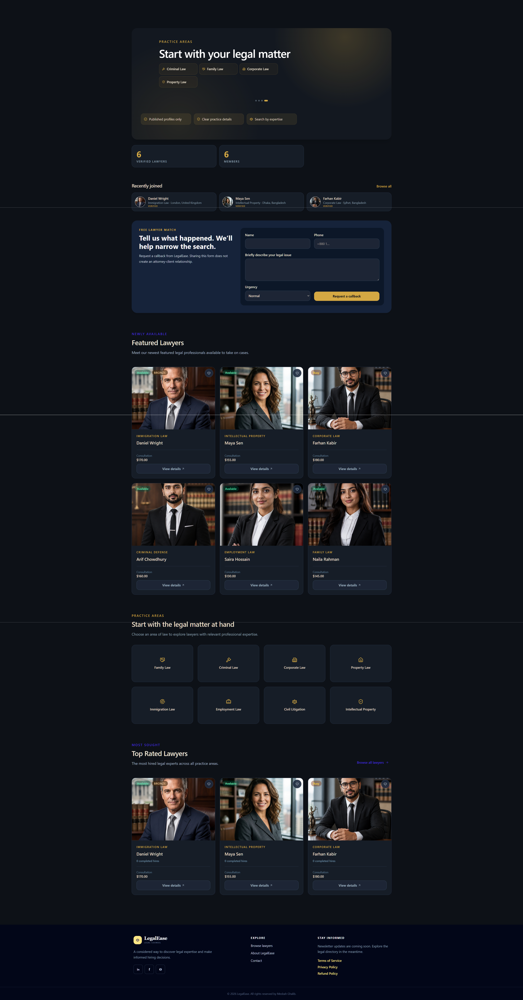
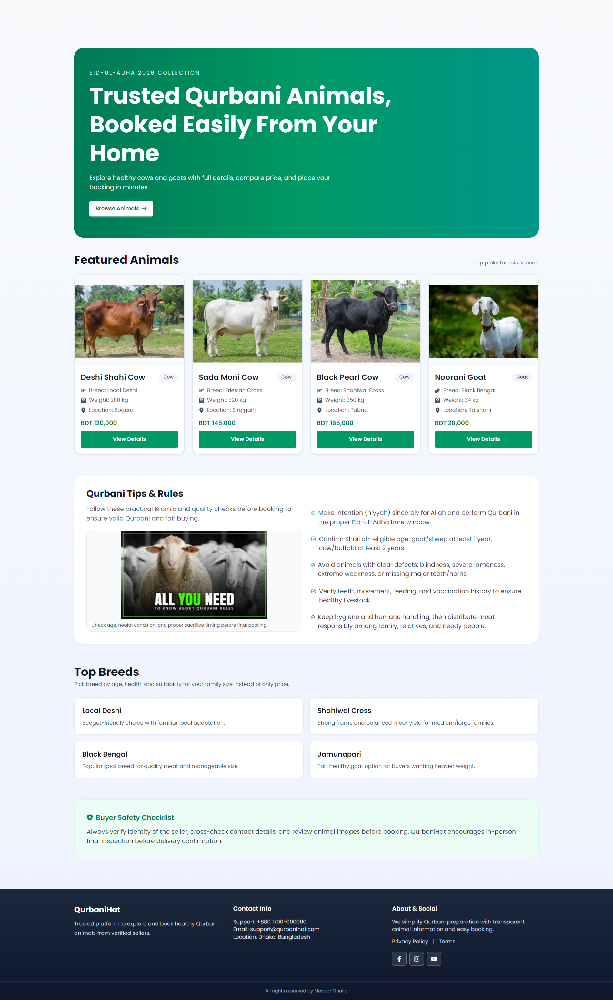

  

<h1 align="center">Hello, I'm Ghalib</h1>

  I build responsive, secure, and maintainable full-stack web applications. 
  My focus is thoughtful user experience, dependable backend workflows, and code that is easy to evolve.

  
  
  

## About Me

I am a MERN stack developer who enjoys taking a product from idea to deployment. I work across React and Next.js interfaces, Node.js and Express APIs, MongoDB data models, authentication, payments, and cloud deployment. My earlier experience in operations and marketing also helps me communicate clearly, understand business needs, and build with the end user in mind.

- Based in **Dhaka, Bangladesh**
- Building with **React, Next.js, Node.js, Express.js, and MongoDB**
- Experienced with **REST APIs, authentication, role-based access, and Stripe integration**
- Interested in clean architecture, accessible interfaces, and practical product engineering
- Contact: **[mesbah.ghalib@gmail.com](mailto:mesbah.ghalib@gmail.com)**

## Technology Stack

  

  

| Area | Technologies |
| --- | --- |
| Frontend | React, Next.js, JavaScript, TypeScript, React Router, Tailwind CSS, DaisyUI |
| Backend | Node.js, Express.js, REST APIs, middleware, JWT authentication |
| Database & Auth | MongoDB, MongoDB Atlas, Mongoose, Firebase Authentication, Better Auth |
| Data & Integrations | TanStack Query, Axios, Stripe Checkout, Google Authentication |
| Tools & Deployment | Git, GitHub, Vite, Vercel, Netlify, Postman, Figma |

## Featured Projects

### LegalEase — Legal Counsel Marketplace

  
  
  

LegalEase is a full-stack marketplace where clients discover published lawyers, submit hiring requests, and complete verified payments while lawyers and administrators manage role-specific workflows.

**Highlights**

- Lawyer discovery with search, filters, sorting, pagination, and detailed public profiles
- Email/password and Google authentication with client, lawyer, and administrator experiences
- Server-authorized hiring and Stripe Checkout with payment verification
- Lawyer moderation, transaction visibility, and data-driven admin analytics

**Built with:** React, Vite, Tailwind CSS, TanStack Query, Axios, Node.js, Express.js, MongoDB, JWT, Stripe, Recharts

---

### PawAdopt — Pet Adoption Platform

  
  
  

PawAdopt connects prospective adopters with pet owners through a responsive browsing experience and protected adoption workflows.

**Highlights**

- Pet browsing with search, species filtering, sorting, and detailed listing pages
- Firebase email/password and Google authentication with reload-safe protected routes
- Listing creation and management, wishlists, and adoption request tracking
- Owner-side request review with duplicate-request prevention and approval controls

**Built with:** React, Vite, JavaScript, Tailwind CSS, HeroUI, Firebase, Axios, Node.js, Express.js, MongoDB

---

### QurbaniHat — Livestock Booking Marketplace

  
  

QurbaniHat is a responsive marketplace for exploring Qurbani animals, comparing listing details, and placing authenticated bookings.

**Highlights**

- Marketplace homepage, complete animal catalogue, price sorting, and detail pages
- Authenticated booking flow with email/password and Google sign-in
- Protected profile management and responsive layouts across device sizes
- Full-stack Next.js architecture backed by MongoDB Atlas

**Built with:** Next.js, React, JavaScript, Tailwind CSS, DaisyUI, Better Auth, MongoDB Atlas

## Professional Background

Before focusing on software development, I worked in operations, administration, and marketing. That experience strengthened the collaboration, ownership, and problem-solving skills I now bring to engineering teams.

- **Executive, Marketing Operations — Jamuna Future Park:** coordinated vendors, tenants, internal teams, event support, documentation, and customer follow-ups.
- **Manager — Dr. Dil Afroza Memorial Hospital:** managed administration, scheduling, procurement, recruitment, onboarding, vendor coordination, and daily operations.

## Education

- **BSc in Computer Science** — University of the People, 2026–Present
- **BBA in Marketing, Minor in HR** — United International University, 2019
- **Advanced Diploma in Business Management** — London East Bank College, London, 2010

## Let's Connect

I am always interested in discussing web development, product ideas, and opportunities to contribute to a collaborative engineering team.

  <a href="mailto:mesbah.ghalib@gmail.com"><strong>Email</strong></a>
  &nbsp;&bull;&nbsp;
  <a href="https://www.linkedin.com/in/mesbahghalib/"><strong>LinkedIn</strong></a>
  &nbsp;&bull;&nbsp;
  <a href="https://github.com/CreativeGhalib?tab=repositories"><strong>GitHub Projects</strong></a>

  Thanks for visiting my profile.

